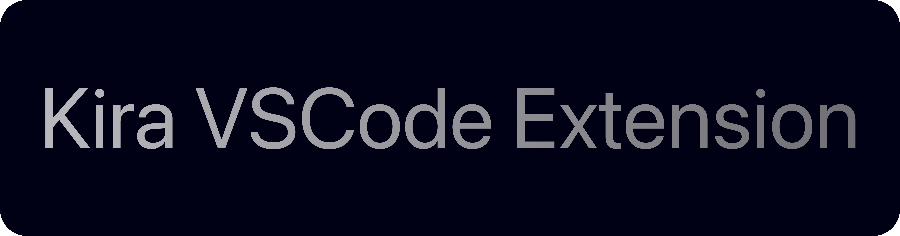

<picture>
  <source media="(prefers-color-scheme: dark)" srcset="Images/KiraBannerDark.png">
  <source media="(prefers-color-scheme: light)" srcset="Images/KiraBannerLight.png">
  
</picture>

# Kira Language Support for Visual Studio Code

Syntax highlighting and editor support for the Kira programming language - a dual-mode compiled language supporting both bytecode VM (@Runtime) and LLVM AOT compilation (@Native).

## Features

### Syntax Highlighting

This extension provides comprehensive syntax highlighting for Kira source files (.kira):

- **Keywords**: Control flow and declarations (`func`, `let`, `return`, `if`, `else`, `import`, `struct`, `for`, `while`, `break`, `continue`)
- **Types**: Built-in types (`int`, `float`, `bool`, `string`)
- **Execution Mode Attributes**: Compilation mode decorators (`@Native`, `@Runtime`, `@Platforms`)
- **Directives**: Platform directives (`#platforms`)
- **Operators**: Arithmetic (`+`, `-`, `*`, `/`, `%`), comparison (`==`, `!=`, `<`, `>`, `<=`, `>=`), logical (`&&`, `||`, `!`), assignment (`=`), and range (`..`, `..=`)
- **Literals**: Strings (`"..."`), numbers (integers and floats), booleans (`true`, `false`)
- **Functions**: Function definitions and built-in functions (`printIn`)
- **Comments**: Line comments (`//`)

### Editor Features

- **Bracket Matching**: Visual matching for parentheses `()`, braces `{}`, and brackets `[]`
- **Auto-Closing**: Automatic insertion of closing brackets and quotes
- **Comment Toggling**: Quick line comment toggling with `Ctrl+/` (Windows/Linux) or `Cmd+/` (macOS)
- **Surrounding Pairs**: Wrap selected text with brackets or quotes

## Supported Kira Language Features

The extension recognizes and highlights the following Kira language constructs:

- Function declarations with the `func` keyword
- Variable declarations with the `let` keyword
- Struct definitions with the `struct` keyword
- Control flow statements (`if`/`else`, `for`, `while`, `break`, `continue`, `return`)
- Module imports with the `import` keyword
- Execution mode attributes for dual compilation targets
- Platform-specific directives for conditional compilation
- All standard operators and type annotations

## Installation

### From VSIX Package

1. Package the extension:
   ```bash
   npm install -g @vscode/vsce
   vsce package
   ```

2. Install the generated `.vsix` file:
   ```bash
   code --install-extension kira-language-support-0.1.0.vsix
   ```

### For Development

1. Copy the `kira-vscode-extension` directory to your VSCode extensions folder:
   - **Windows**: `%USERPROFILE%\.vscode\extensions\`
   - **macOS/Linux**: `~/.vscode/extensions/`

2. Reload VSCode (or restart the application)

3. Open any `.kira` file to activate syntax highlighting

## Example

```kira
// Kira example with syntax highlighting
@Native
func fibonacci(n: int) -> int {
    if n <= 1 {
        return n;
    }
    return fibonacci(n - 1) + fibonacci(n - 2);
}

@Runtime
func main() {
    let result: int = fibonacci(10);
    printIn("Fibonacci(10) = " + result);
}
```

## License

Apache 2.0 with Runtime Library Exception

This extension is licensed under the Apache License 2.0 with the LLVM Runtime Library Exception. See the LICENSE file for details.

## Contributing

Contributions are welcome! Please ensure all JSON configuration files remain under 200 lines per Kira conventions.

## Support

For issues, feature requests, or questions about the Kira language, please visit the Kira project repository.
